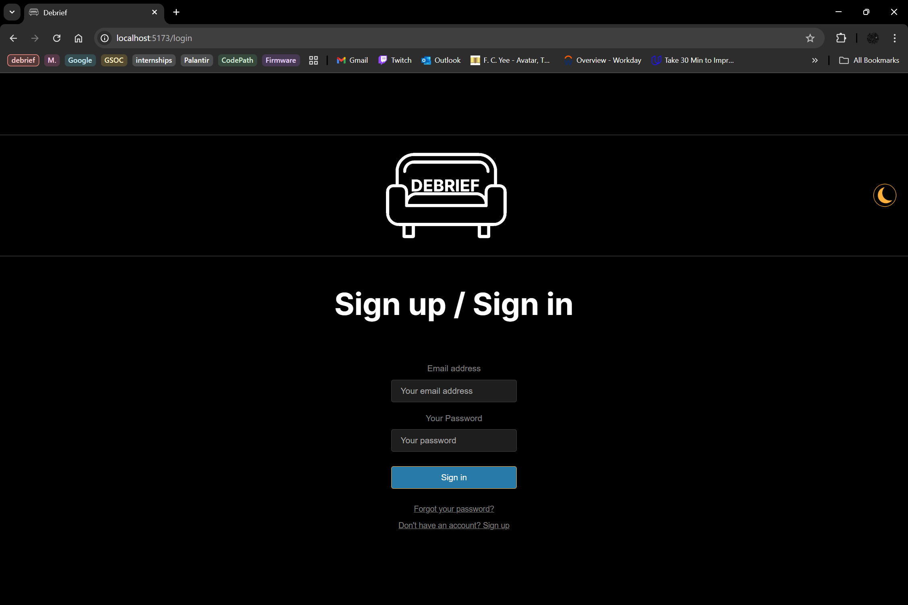

# Web Development Final Project - *DeBrief*

Submitted by: **Soluchi Fidel-Ibeabuchi**

This web app: **A modern fandom-focused social media platform built with React and Supabase. Share posts about your favorite TV shows, movies, and fandoms with episode-specific discussions, spoiler warnings, and community interactions.**

Time spent: **10** hours spent in total

## Required Features

The following **required** functionality is completed:

- [x] **Web app includes a create form that allows the user to create posts**
  - Form requires users to add a post title
  - Forms should have the *option* for users to add: 
    - additional textual content
    - an image added as an external image URL
- [x] **Web app includes a home feed displaying previously created posts**
  - Web app must include home feed displaying previously created posts
  - By default, each post on the posts feed should show only the post's:
    - creation time
    - title 
    - upvotes count
  - Clicking on a post should direct the user to a new page for the selected post
- [x] **Users can view posts in different ways**
  - Users can sort posts by either:
    -  creation time
    -  upvotes count
  - Users can search for posts by title
- [x] **Users can interact with each post in different ways**
  - The app includes a separate post page for each created post when clicked, where any additional information is shown, including:
    - content
    - image
    - comments
  - Users can leave comments underneath a post on the post page
  - Each post includes an upvote button on the post page. 
    - Each click increases the post's upvotes count by one
    - Users can upvote any post any number of times

- [x] **A post that a user previously created can be edited or deleted from its post pages**
  - After a user creates a new post, they can go back and edit the post
  - A previously created post can be deleted from its post page

The following **optional** features are implemented:

- [x] Web app implements authentication
  - Only the original user author of a post can update or delete it. Web app doesn't allow unauthorized
    post update or deletion even when edit url is hardcoded into the address bar
- [x] Users can customize the interface
  - Users can toggle dark mode with the icon in the dark corner
- [x] Users can add more characterics to their posts
  - Users can set spoiler flag and specifiy the season or episode (or none if its a movie) while creating a post
  - Users can filter posts by spoiler flag on the home feed
- [x] Web app displays a loading animation whenever data is being fetched

The following **additional** features are implemented:

* [x] Web app uses real user authentication using email and password
* [x] Current fandoms can be seen in the sidebar
* [x] The Home button takes users back to the homepage
* [x] The "My Posts" button isn't functional but it's meant to filter out posts that aren't owned by the user

## Video Walkthrough

Here's a walkthrough of various aspects of the project:

### Page Screenshots

 

### Home Page functionality

### Adding Posts

### Authentication

### Editing Posts

### Deletion and Other Post interactions

<!-- Replace this with whatever GIF tool you used! -->
GIF created with screentogif
<!-- Recommended tools:
[Kap](https://getkap.co/) for macOS
[ScreenToGif](https://www.screentogif.com/) for Windows
[peek](https://github.com/phw/peek) for Linux. -->

## Notes

While building this React/Supabase app, the main challenges likely included managing authentication state and Row Level Security policies to ensure proper user permissions, implementing complex filtering/sorting functionality while balancing client-side vs server-side performance, creating a responsive UI with theme switching and collapsible sidebar, debugging Supabase-specific issues like case-sensitive table names and query syntax, handling async operations safely (especially avoiding null/undefined errors like with the spread operator), setting up proper error handling and loading states for CRUD operations, and integrating React Router with protected routes while maintaining real-time data synchronization across components. Handling the styling was also a problem as always.

## License

    Copyright 2025 Soluchi Fidel-Ibeabuchi

    Licensed under the Apache License, Version 2.0 (the "License");
    you may not use this file except in compliance with the License.
    You may obtain a copy of the License at

        http://www.apache.org/licenses/LICENSE-2.0

    Unless required by applicable law or agreed to in writing, software
    distributed under the License is distributed on an "AS IS" BASIS,
    WITHOUT WARRANTIES OR CONDITIONS OF ANY KIND, either express or implied.
    See the License for the specific language governing permissions and
    limitations under the License.